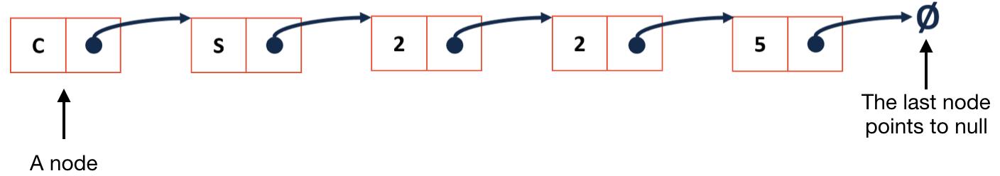
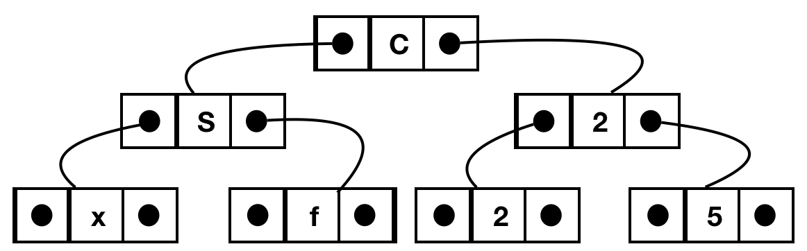
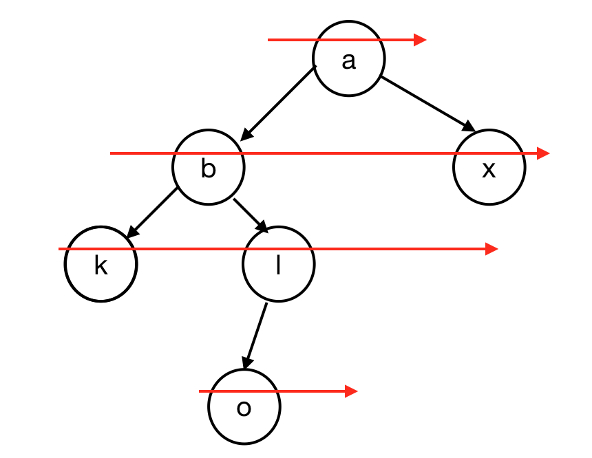
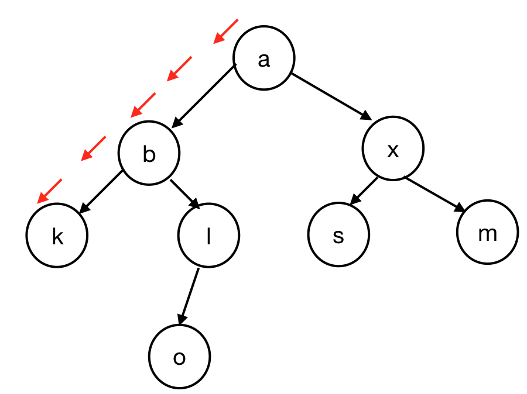
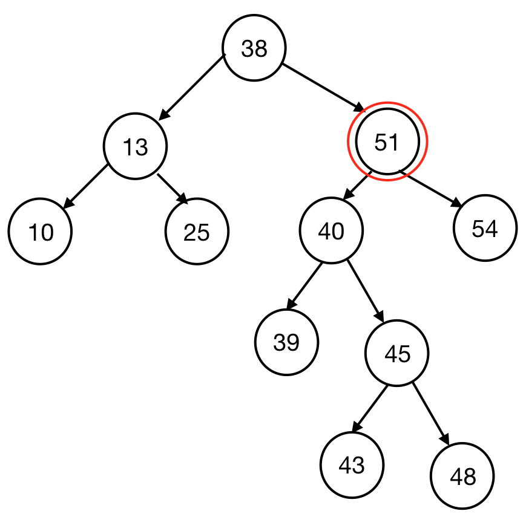
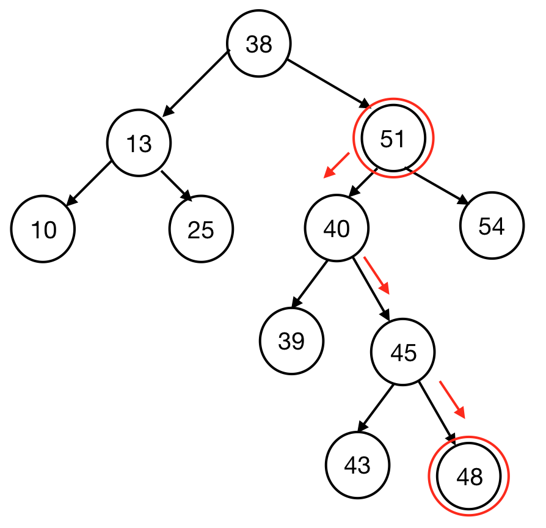
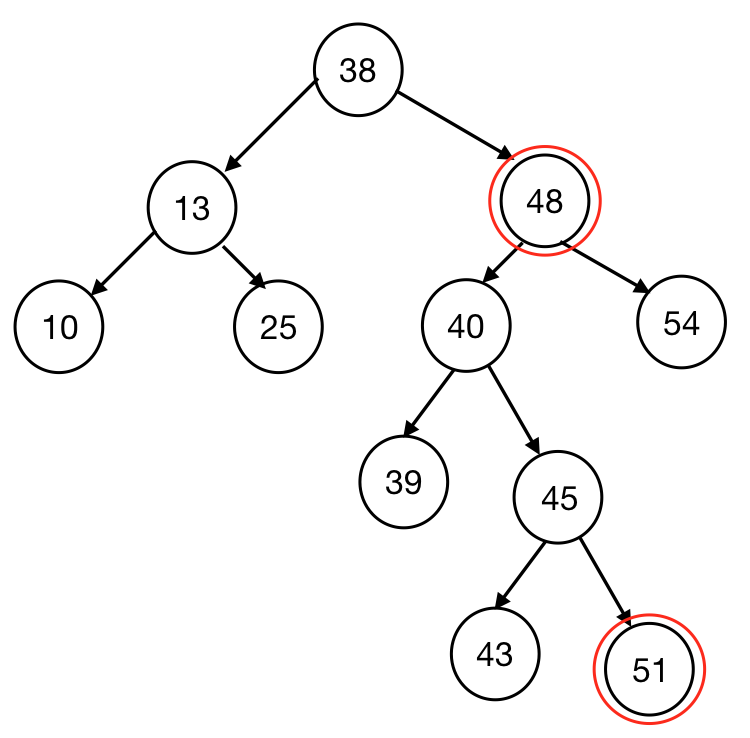

# CS225 Final Exam Review

This is a study guide I created to help prepare for the scary CS225 final exam at U of I! This is by no means complete, I only included content that *I* found unfamiliar. 

# Study Resources

- [Lecture Slides (`/slides`)](/slides)
- [Lecture Hangouts (`/handouts`)](/handouts)
- [Lecture Code (`/code`)](/code)
- [Lecture Notes by TAs (`/notes`)](/notes)

# Final Exam Topics

- [C++ Basics](cpp.md)
- [Abstract Data Types (ADT)](adt.md)
  - List ADT
  - Stack ADT
  - Queue ADT
  - Iterator
- [Tree Basics](tree_basics.md)
  - Binary Tree
  - Traversal
  - Search
- [Tree Advanced](tree_bst_avl.md)
  - BST Tree (Binary Search Tree)
  - AVL Tree
- kd-Tree
- BTree
- Hashing
- Heaps
- Disjoint Sets
- Graphs
- Minimum Spanning Tree (MST)
- Prim's MST
- Single Source Shortest Path (SSSP)
- All Pairs Shortest Path (APSP)

# C++ Basics

### Encapsulation

Separate the interface from implementation but still keep them as a cohesive unit.

### `#pragma once`

Telling compiler that this particular file will be included only once within this single compilation. 

### Reference Variable

An alias to an existing variable. Never creates new memory.

### Pointers

Stores a memory address of the instance instead of storing data.

### Stack Memory 

Default type memory, starts near the top of memory.

### Heap Memory

- Starts from low memory values and grows up. 
- Use `new` to create, `delete` to free. 
- Memory leak is when we don't `delete` when done.

### `const` Function Parameter

- `Cube joinCubes(const Cube & c1)` to prevent the parameters passed in to be changed. 
- `double getVolume() const;` means that `getVolume()` guarantees it will not modify the value.

### `virtual` Function

- Allow us to override the function in derived classes.

Let's say we have 2 classes...
```cpp
class Animal
{
    public:
        _____ void eat() { std::cout << "I'm eating generic food."; }
};

class Cat : public Animal
{
    public:
        void eat() { std::cout << "I'm eating a rat."; }
};
```

and I create these in `main.cpp`...
```cpp
Animal *animal = new Animal;
Cat *cat = new Cat;
```

this should be easy...
```cpp
animal->eat(); // Outputs: "I'm eating generic food."
cat->eat();    // Outputs: "I'm eating a rat."
```

but now with this new function I created in `main.cpp`...
```cpp
void func(Animal *xyz) { xyz->eat(); }
```

Case 1, `void eat()...` in `class Animal` (without `virtual`):

```cpp
func(animal); // Outputs: "I'm eating generic food."
func(cat);    // Outputs: "I'm eating generic food."
```

Case 2, `virtual void eat()...` in `class Animal` (with `virtual`):
```cpp
func(animal); // Outputs: "I'm eating generic food."
func(cat);    // Outputs: "I'm eating a rat."
```

### Templates

- A dynamic data type
- Using `Template <typename T>` so that we do not need to write same function for various types

```cpp
template <typename T>
T maximum(T a, T b) {
     T result;
     result = (a > b) ? a : b;
     return result;
}
```

# Abstract Data Types (ADT)

ADT describes functionality but not implementation details.

## List ADT



|                              | Singly Linked List | ArrayList                             |
| ---------------------------- | ------------------ | ------------------------------------- |
| Insert/Remove at Front       | O(1)               | O(1) (amortized)                      |
| Insert at a given element    | O(1)               | O(n) (needs to copy everything after) |
| Remove a given element       | O(1)               | O(n)                                  |
| Insert an arbitrary element  | O(n)               | O(n)                                  |
| Remove at arbitrary location | O(n)               | O(n)                                  |

### Linked List

```cpp
// Implementation

template <typename T>
class List {
     public:
          /* ... */
     private:    
         class ListNode {
              T & data;
              ListNode * next;
              ListNode(T & data) : data(data), next(NULL) { }
         };
};
```

```cpp
// Find: Recursive

template <typename T>
typename List<T>::ListNode *& List<T>::_index(unsigned index) {
  return _index_helper(index, _head);
}

ListNode *& _index_helper(unsigned index, ListNode *& node) {
  if (index == 0) {
    return node;
  } else {
    return _index_helper(index - 1, node -> next);
}
```

```cpp
// Find: Iterative
//       Moving the pointer one by one until it's at the right location.

template <typename T>
typename List<T>::ListNode *& List<T>::_index(unsigned index) {
  if (index == 0) {
    return head;
  } else {
    ListNode *thru = head;
    for (unsigned i = 0; i < index - 1; i++) {
      thru = thru->next;
    }
    return thru->next;
  }
}
```

```cpp
// Operator []

template <typename T>
T & List<T>::operator[](unsigned index) {
  ListNode *& d = _index(index);
  return d -> data;
}
```

```cpp
// Insert

template <typename T>
void List<T>::insert(const T & t, unsigned index) {
  ListNode *& node = _index(index);
  ListNode * newNode = new ListNode(t);
  newNode -> next = node;
  node = newNode;
}
```

## Stack

Like dining hall plates.

- push
- pop

## Queue 

Like a line is Disneyland.

- enqueue
- dequeue

## Iterator (on List)

To implement an iterator, must have
- `begin()`
- `end()`
- `operator++`
- `operator*`
- `operator!=`

```cpp
for (std::vector<Animal>::iterator it = zoo.begin(); it != zoo.end(); it++) {
  std::cout << (*it).name << " " << (*it).food << std::endl;
}
```

# Trees



## Binary Trees

Each node has **at most** 2 children.

### Full Tree

Each node has either 2 or 0 children.

### Perfect Tree

Full tree + all leaves same distance from root.

### Complete Tree

Full tree + perfect tree except last level, where all leaves are "pushed to the left."

## Traversal

To **traverse** a tree means we process every element exactly once in a tree.

```cpp
// pre-order

void BinaryTree<T>::preOrder(TreeNode * cur) {
  if (cur != NULL) {
    print(cur->data);     // print is some imaginary function
    preOrder(cur->left);
    preOrder(cur->right);
  }
}
```

```cpp
// in-order

void BinaryTree<T>::inOrder(TreeNode * cur) {
  if (cur != NULL) {
    inOrder(cur->left);
    print(cur->data); 
    inOrder(cur->right);
  }
}
```

```cpp
// post-order

void BinaryTree<T>::postOrder(TreeNode * cur) {
  if (cur != NULL) {
    postOrder(cur->left);
    postOrder(cur->right);
    print(cur->data);  
  }
}
```

## Search

### BFS

- Visit nearby nodes quickly by each level.
- In other words, visit the direct descendants quicker (level-order traversal).



### DFS

- Find the endpoint of a path quickly, and to move deeper into the tree as quickly as possible.
- In other words, we visit the leaves as soon as possible. 



# BST Tree (Binary Search Tree)

Binary tree but
- Everything to the left of root < root
- Everything to the right of root > root

## Find

```cpp
// Find

TreeNode *& BST::_find(TreeNode *& root, const K & key) const {
     If (root == NULL || key == root->key) {
          return root;  //root is null when we cannot find
     }
     If (key < root->key) {
          return _find(root->left, key);
     }
     If (key > root->key) {
          return _find(root->right, key);
     }
}
```

## Remove

1. Find inorder predecessor (IOP), the largest node in the left subtree (the rightmost node).
2. Swap IOP and the node we want to delete.
3. The node is now a leaf, so we can remove it.

<!-- 

 -->

## BST Analysis

| Operation | BST Average Case | BST Worst Case | Sorted Array                      | Sorted List              |
| --------- | ---------------- | -------------- | --------------------------------- | ------------------------ |
| find      | O(lg n)          | O(h) <= O(n)   | O(lg n) with binary search        | O(n) no binary search    |
| insert    | O(lg n)          | O(h) <= O(n)   | O(n) with find O(lg n), move O(n) | O(n) find data with O(n) |
| delete    | O(lg n)          | O(h) <= O(n)   | O(n)                              | O(n)                     |
| traverse  | O(n)             | O(n)           | O(n)                              | O(n)                     |

## Balance Factor

### b = height(TR) - height(TL)

- left heavy: b negative
- right heavy: b positive
- balanced: if |b| <= 1
- lowest point of imbalance: the deepest node in the tree that is out of balance

## BST Rotation

- 4 kinds of rotation
- All rotations local
- All rotations run in O(1)

# AVL Tree

self-balancing Binary Search