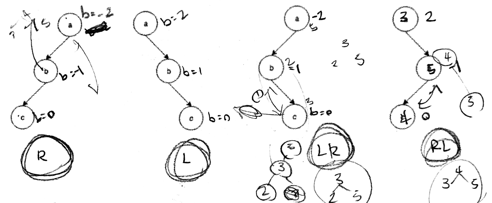
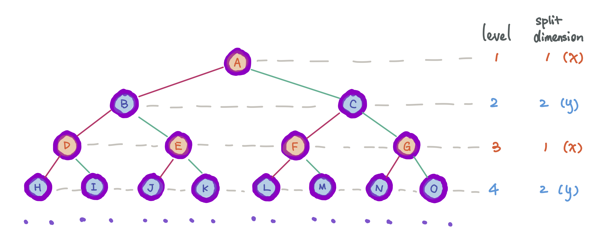
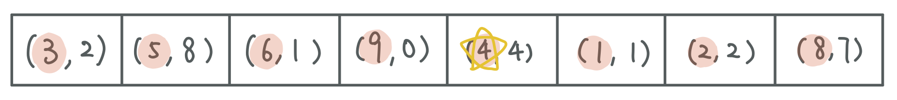
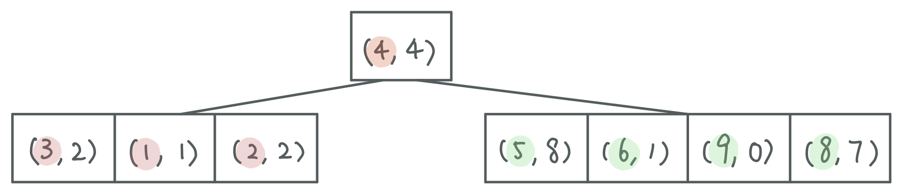
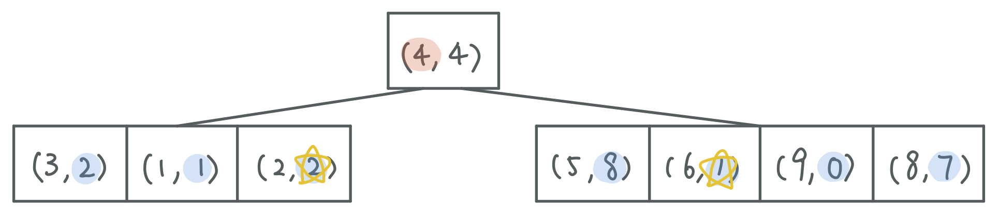
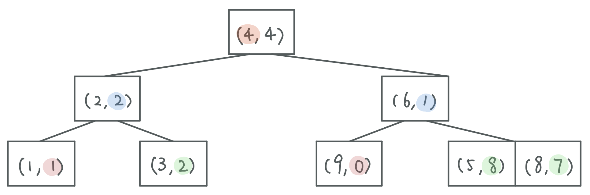
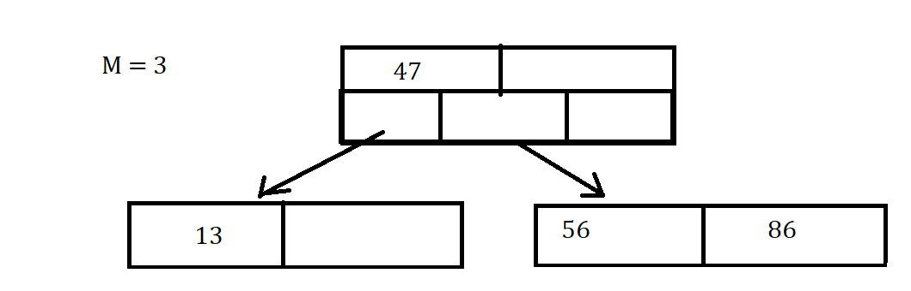
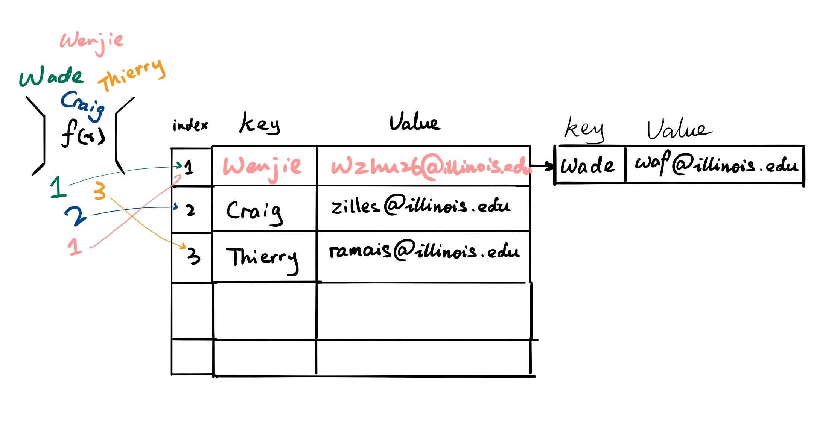
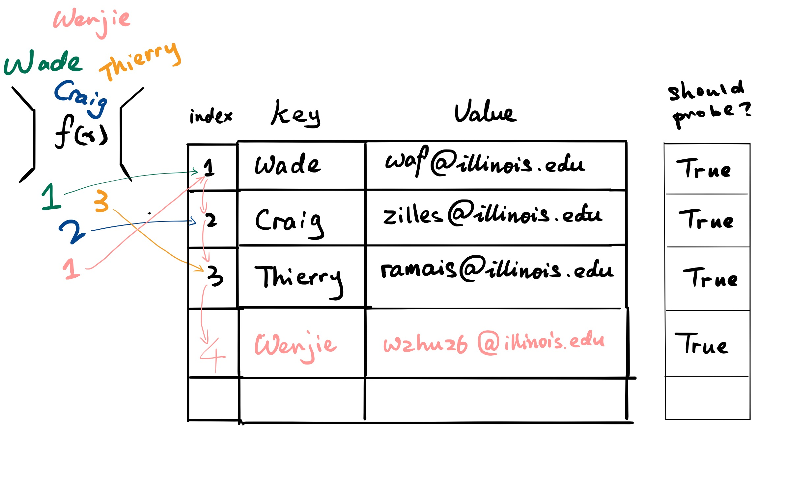
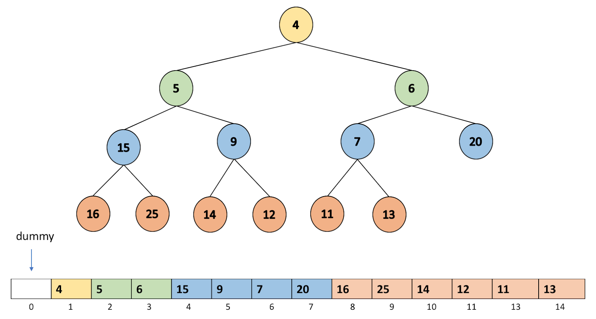

# CS225 Final Exam Review

This is a study guide I created to help prepare for the scary CS225 final exam at U of I! This is by no means complete, I only included content that *I* found unfamiliar. 

## Study Resources

- [Lecture Slides (`/slides`)](/slides)
- [Lecture Hangouts (`/handouts`)](/handouts)
- [Lecture Code (`/code`)](/code)
- [Lecture Notes by TAs (`/notes`)](/notes)

## Final Exam Topics

- [C++ Basics](cpp.md)
- List
  - Iterator
- Stack
- Queue
- Binary Tree
  - Traversal
  - Search
- BST, AVL, Red Black Tree
- k-d Tree
- B Tree
- Hashing
- Heaps (Priority Queues)
- Disjoint Sets
- Graphs
  - Kruskal's MST (Minimum Spanning Tree)
  - Prim's MST
  - Dijkstra's SSSP (Single Source Shortest Path)
  - Floyd-Warshall's APSP (All Pairs Shortest Path)

# C++ Basics

### Encapsulation

Separate the interface from implementation but still keep them as a cohesive unit.

### `#pragma once`

Telling compiler that this particular file will be included only once within this single compilation. 

### Reference Variable

An alias to an existing variable. Never creates new memory.

### Pointers

Stores a memory address of the instance instead of storing data.

### Stack Memory 

Default type memory, starts near the top of memory.

### Heap Memory

- Starts from low memory values and grows up. 
- Use `new` to create, `delete` to free. 
- Memory leak is when we don't `delete` when done.

### `const` Function Parameter

- `Cube joinCubes(const Cube & c1)` to prevent the parameters passed in to be changed. 
- `double getVolume() const;` means that `getVolume()` guarantees it will not modify the value.

### `virtual` Function

- Allow us to override the function in derived classes.

Let's say we have 2 classes...
```cpp
class Animal
{
    public:
        _____ void eat() { std::cout << "I'm eating generic food."; }
};

class Cat : public Animal
{
    public:
        void eat() { std::cout << "I'm eating a rat."; }
};
```

and I create these in `main.cpp`...
```cpp
Animal *animal = new Animal;
Cat *cat = new Cat;
```

this should be easy...
```cpp
animal->eat(); // Outputs: "I'm eating generic food."
cat->eat();    // Outputs: "I'm eating a rat."
```

but now with this new function I created in `main.cpp`...
```cpp
void func(Animal *xyz) { xyz->eat(); }
```

Case 1, `void eat()...` in `class Animal` (without `virtual`):

```cpp
func(animal); // Outputs: "I'm eating generic food."
func(cat);    // Outputs: "I'm eating generic food."
```

Case 2, `virtual void eat()...` in `class Animal` (with `virtual`):
```cpp
func(animal); // Outputs: "I'm eating generic food."
func(cat);    // Outputs: "I'm eating a rat."
```

### Templates

- A dynamic data type
- Using `Template <typename T>` so that we do not need to write same function for various types

```cpp
template <typename T>
T maximum(T a, T b) {
     T result;
     result = (a > b) ? a : b;
     return result;
}
```

# List

## Abstract Data Types (ADT) 

ADT describes functionality but not implementation details.


## Linked List

```cpp
// Implementation

class List {
     public:
          /* ... */
     private:    
         class ListNode {
              T & data;
              ListNode * next;
              ListNode(T & data) : data(data), next(NULL) { }
         };
};
```

```cpp
// Find: Recursive

ListNode *& _index(unsigned index) {
  return _index_helper(index, _head);
}

ListNode *& _index_helper(unsigned index, ListNode *& node) {
  if (index == 0) {
    return node;
  } else {
    return _index_helper(index - 1, node -> next);
}
```

```cpp
// Find: Iterative
//       Moving the pointer one by one until it's at the right location.

ListNode *& _index(unsigned index) {
  if (index == 0) {
    return head;
  } else {
    ListNode *thru = head;
    for (unsigned i = 0; i < index - 1; i++) {
      thru = thru->next;
    }
    return thru->next;
  }
}
```

```cpp
// Operator []

T & operator[](unsigned index) {
  ListNode *& d = _index(index);
  return d -> data;
}
```

```cpp
// Insert

void nsert(const T & t, unsigned index) {
  ListNode *& node = _index(index);
  ListNode * newNode = new ListNode(t);
  newNode -> next = node;
  node = newNode;
}
```

## Iterator on List

To implement an iterator, must have
- `begin()`
- `end()`
- `operator++`
- `operator*`
- `operator!=`

```cpp
for (std::vector<Animal>::iterator it = zoo.begin(); it != zoo.end(); it++) {
  std::cout << (*it).name << " " << (*it).food << std::endl;
}
```

|                              | Singly Linked List | ArrayList                             |
| ---------------------------- | ------------------ | ------------------------------------- |
| Insert/Remove at Front       | O(1)               | O(1) (amortized)                      |
| Insert at a given element    | O(1)               | O(n) (needs to copy everything after) |
| Remove a given element       | O(1)               | O(n)                                  |
| Insert an arbitrary element  | O(n)               | O(n)                                  |
| Remove at arbitrary location | O(n)               | O(n)                                  |

# Stack

Like dining hall plates.

- push
- pop

# Queue 

Like a line is Disneyland.

- enqueue
- dequeue

# Binary Trees

Each node has **at most** 2 children.

## Full Tree

Each node has either 2 or 0 children.

## Perfect Tree

Full tree + all leaves same distance from root.

## Complete Tree

Full tree + perfect tree except last level, where all leaves are "pushed to the left."


# Traversal (on Tree)

To **traverse** a tree means we process every element exactly once in a tree.

```cpp
// pre-order

void preOrder(TreeNode * cur) {
  if (cur != NULL) {
    print(cur->data);     // print is some imaginary function
    preOrder(cur->left);
    preOrder(cur->right);
  }
}
```

```cpp
// in-order

void inOrder(TreeNode * cur) {
  if (cur != NULL) {
    inOrder(cur->left);
    print(cur->data); 
    inOrder(cur->right);
  }
}
```

```cpp
// post-order

void postOrder(TreeNode * cur) {
  if (cur != NULL) {
    postOrder(cur->left);
    postOrder(cur->right);
    print(cur->data);  
  }
}
```

# Search (on Tree)

## BFS

- Visit nearby nodes quickly by each level.
- In other words, visit the direct descendants quicker (level-order traversal).


## DFS

- Find the endpoint of a path quickly, and to move deeper into the tree as quickly as possible.
- In other words, we visit the leaves as soon as possible. 


# BST Tree (Binary Search Tree)

Binary tree but
- Everything to the left of root < root
- Everything to the right of root > root

## Find

```cpp
// Find

TreeNode *& _find(TreeNode *& root, const K & key) const {
     If (root == NULL || key == root->key) {
          return root;  //root is null when we cannot find
     }
     If (key < root->key) {
          return _find(root->left, key);
     }
     If (key > root->key) {
          return _find(root->right, key);
     }
}
```

## Remove

- No child: Just remove
- 1 child: Swap with child then remove
- 2 children: Swap with IOP then remove, like this:

1. Find inorder predecessor (IOP), the largest node in the left subtree (the rightmost node).
2. Swap IOP and the node we want to delete.
3. The node is now a leaf, so we can remove it.

<!-- 

 -->

## BST Analysis

| Operation | BST Average Case | BST Worst Case | Sorted Array                      | Sorted List              |
| --------- | ---------------- | -------------- | --------------------------------- | ------------------------ |
| find      | O(lg n)          | O(h) <= O(n)   | O(lg n) with binary search        | O(n) no binary search    |
| insert    | O(lg n)          | O(h) <= O(n)   | O(n) with find O(lg n), move O(n) | O(n) find data with O(n) |
| delete    | O(lg n)          | O(h) <= O(n)   | O(n)                              | O(n)                     |
| traverse  | O(n)             | O(n)           | O(n)                              | O(n)                     |

## Balance Factor

b = height(TR) - height(TL)

- left heavy: b negative
- right heavy: b positive
- balanced: if |b| <= 1
- lowest point of imbalance: the deepest node in the tree that is out of balance

## BST Rotation

- 4 kinds of rotation (L, R, LR, RL)
  - Simple rotations: **stick**
  - Complex rotations: **elbow**
- All rotations local
- All rotations run in O(1)



# AVL Tree

**Self-Balancing BST** where the difference between heights of left and right subtrees cannot be more than 1.

To maintain height of tree:
1. Check for imbalance.
2. Correct it (do rotations).
3. Update height.

## Running Time

- **O(lg(n))** for all operations.

## Number of Rotations

- Find: 0
- Insert: up to 1 (L, R, LR, or RL)
- Delete: up to h (O(lg(n)))

# Red Black Tree

- Almost the same as AVL Trees.
- Maximal height is 2 * lg(n) = O(lg(n)).

# Summary: Every Data Structure So Far

| Worst runtime | Unsorted Array                      | Sorted Array               | Unsorted List    | Sorted List | Binary Tree (unsorted) | BST     | AVL     |
| ------------- | ----------------------------------- | -------------------------- | ---------------- | ----------- | ---------------------- | ------- | ------- |
| find          | O(n)                                | O(lg n) Binary search      | O(n)             | O(n)        | O(n)                   | O(h)<=n | O(lg n) |
| insert        | O(1)* InsertEnd and resize properly | O(n) Shifting up to ½ data | O(1) InsertFront | O(n)        | O(1) Insert at root    | O(h)<=n | O(lg n) |
| remove        | O(n)                                | O(n)                       | O(n)             | O(n)        | O(n)                   | O(h)<=n | O(lg n) |
| traverse      | O(n)                                | O(n)                       | O(n)             | O(n)        | O(n)                   | O(n)    | O(n)    |

*: amortized runtime

# k-d Tree

- aka **k-dimensional tree**.
- A **BST** that organizes points in k dimensional space. 
- Every node in a k-d Tree contains one point. 
- Every parent node splits the space into two subspaces based on a certain dimension. 
- Every node in its left subtree is in the left subspace, and every node in its right subtree is in the right subspace. 
- The dimension that a node is splitting on depends on which level of the tree this node is in.
- Useful for range and nearest neighbor searches.

## Constructing a k-d Tree

### 1. Alternate splitting dimension

- Each node splits the space in a certain dimension. 
- Nodes on the i th level split the space in the i th dimension. 
- If i is greater than k, the dimension wraps back around to i mod k.

Example: a 2-d k-d tree, each node on a odd level splits the x dimension, and each node on a even level splits the y dimension:



### 2. Find the median

- Each node split the space such that number of nodes in the left subspace = right subspace.
- We pick the median among the nodes for the **current dimension** and make it the subroot.

### 3. Recurse on subtrees

Given this array to construct a k-d tree:


Find the median in terms of **current dimension** (dimension 1):



Partition so that smaller on left, greater on right:



Find the median in terms of **current dimension** (dimension 2):



Repeat this process until the array only consists of one node:



# B Tree (of order `m`)

- Each node holes 2 arrays
  - first holds the keys of the node
  - second holds pointers to the children



## Properties

- Keys within a node are ordered
- Leaves contain no more than `m-1` keys
- Internal nodes have exactly one more child than keys
- Root nodes can have `2` to `m` children
- Internal nodes can have `ceil(m/2)` to `m` children
- All leaves are at the same depth, which makes the tree balanced

## Find

```cpp
template <class K, class V>
V BTree<K, V>::find(const BTreeNode* subroot, const K& key) const
{
    /* If first_larger_idx is a valid index and the key there is the key we
     * are looking for, we are done. */

    /* Otherwise, we need to figure out which child to explore. For this we
     * can actually just use first_larger_idx directly. E.g.
     * | 1 | 5 | 7 | 8 |
     * Suppose we are looking for 6. first_larger_idx is 2. This means we want to
     * explore the child between 5 and 7. The children vector has a pointer for
     * each of the horizontal bars. The index of the horizontal bar we want is
     * 2, which is conveniently the same as first_larger_idx. If the subroot is
     * a leaf and we didn't find the key in it, then we have failed to find it
     * anywhere in the tree and return the default V.
     */

    size_t first_larger_idx = insertion_idx(subroot->elements, key);

    if (first_larger_idx < subroot->elements.size() && subroot->elements[first_larger_idx].key == key) {
        return subroot->elements[first_larger_idx].value;
    }

    if (subroot->is_leaf) {
        return V();
    } else {
        return find(subroot->children[first_larger_idx], key);
    }
}
```

## Runtime

- Search: `O(log n)`
- Combining/Splitting of Keys: `O(m)`
- Insert/Delete: `O((m/log m) * log n)`

# Hashing

- The hash function: f(h) -> Integers
- The compression: Integer -> array
- Handling collisions

## Resolving Collisions

### Seperate Chaining



```cpp
void insert(K key, V value) {

    elems++;

    if (shouldResize()) { resizeTable(); }

    size_t idx = hash(key, size);

    pair<K, V> insert(key, value);

    // table is list<pair<K, V>>[size];
    table[idx].push_front(insert);
}
```

```cpp
void remove(K key) {

    typename list<pair<K, V>>::iterator it;

    size_t idx = hash(key, size);

    for (it = table[idx].begin(); it != table[idx].end(); it++) {
        if (it->first == key) {

            table[idx].remove(it);
            elems--;
            return;

        }
    }
}
```

```cpp
V find(K key) {

    typename list<pair<K, V>>::iterator it;

    size_t idx = hash(key, size);

    for (it = table[idx].begin(); it != table[idx].end(); it++) {
        if (it->first == key) {

            return it->second;

        }
    }
}
```

```cpp
void resizeTable() {

    typename list<pair<K, V>>::iterator it;

    size_t newSize = findPrime(s * size);

    list<pair<K, V>> * newTable = new list<pair<K, V>>[newSize];

    for (size_t i = 0; i < size; i++) {
        for (it = table[i].begin(); it != table[i].end(); i++) {

            size_t = newIdx = hash(key, size);
            pair<K, V> newPair(it_.first, it->second);
            newTable[newIdx].push_front(newPair);

        }
    }

    size  = newSize;
    table = newTable;
}
```

### Linear Probing



Flags for whether or not to probe forward when looking at a particular cell in the table.
```cpp
bool * should_probe;
```

```cpp
void insert(K key, V value) {

    elems++;

    if (shouldResize()) { resizeTable(); }

    size_t insertIndex = hash(key, size);

    while (table[insertIndex] != NULL) {
        insertIndex = ((insertIndex + 1) % size);
    }

    table[insertIndex] = new pair<K, V>(key, value);

    should_probe[insertIndex] = true;
}
```

```cpp
void remove(K key) {

    int removeIndex = findIndex(key);

    if (removeIndex != -1) {
        delete table[removeIndex];
        table[removeIndex] = NULL;

        elems--;
    }
}
```

```cpp
V find(K & key) {

    // see below
    int idx = findIndex(key);

    if (idx != -1) {
        return table[idx]->second;
    }
    
    return V();
}
```

```cpp
int findIndex(K & key) {

    size_t findIndex = hash(key, size);

    size_t orgIndex = findIndex;

    while (should_probe[findIndex] == true) {

        if (table[findIndex]->first == key) {    
            return findIndex;
        }

        findIndex = (findIndex + 1) % size;

        if (findIndex == orgIndex) {
            break;
        }

    }

    return -1;
}
```

```cpp
void resizeTable() {

    size_t newSize = findPrime(size * 2);

    pair<K, V>** resizeTemp = new pair<K, V>*[newSize];

    delete[] should_probe;
    should_probe = new bool[newSize];

    for (size_t i = 0; i < newSize; i++) {
        resizeTemp[i] = NULL;
        should_probe[i] = false;
    }

    for (size_t i = 0; i < size; i++) {
        if (table[i]) {
            size_t index = hash(table[i]->first, newSize);
            while (resizeTemp[index] != NULL) {
                index = ((index + 1) % newSize);
            }
            resizeTemp[index] = table[i];
            should_probe[index] = true;
        }
    }

    delete[] table;
    table = resizeTemp;
    size = newSize;

}
```

### Double Hashing

```cpp
void insert(K & key, V & value) {

    elems++;

    if (shouldResize()) {
        resizeTable();
    }

    size_t insertIndex = hashes::hash(key, size);
    size_t secondHash  = hashes::secondary_hash(key, size);

    while (table[insertIndex] != NULL) {
        insertIndex = ((insertIndex + secondHash) % size);
    }

    table[insertIndex] = new pair<K, V>(key, value);

    should_probe[insertIndex] = true;
}
```

```cpp
void remove(K & key) {

    int removeIndex = findIndex(key);

    if (removeIndex != -1) {
        delete table[removeIndex];
        table[removeIndex] = NULL;
        elems--;
    }
}
```

```cpp
V find(K & key) const {
    int idx = findIndex(key);
    if (idx != -1) return table[idx]->second;
    return V();
}
```

```cpp
int findIndex(K & key) {

    size_t findIndex  = hashes::hash(key, size);
    size_t secondHash = hashes::secondary_hash(key, size);
    size_t orgIndex   = findIndex;

    while (should_probe[findIndex]) {

        if (table[findIndex]->first == key) {
            return findIndex;
        }

        findIndex = (findIndex + secondHash) % size;

        if (findIndex == orgIndex) {
            break;
        }
    }

    return -1;
}
```

```cpp
void resizeTable() {

    size_t newSize = findPrime(size * 2);

    pair<K, V>** temp = new pair<K, V>*[newSize];

    // create a new should_probe that fits the new size
    delete[] should_probe;
    should_probe = new bool[newSize];

    // init the new table we created
    for (size_t i = 0; i < newSize; i++) {
        temp[i] = NULL;
        should_probe[i] = false;
    }

    for (size_t slot = 0; slot < size; slot++) {

        if (table[slot] != NULL) {

            size_t h    = hashes::hash(table[slot]->first, newSize);
            size_t jump = hashes::secondary_hash(table[slot]->first, newSize);
            size_t i    = 0;
            size_t idx  = h;

            while (temp[idx] != NULL) {
                ++i;
                idx = (h + jump * i) % newSize;
            }

            temp[idx] = table[slot];
            should_probe[idx] = true;
        }
    }

    delete[] table;
    
    table = temp;
    size = newSize;
}
```

# Heaps (Priority Queues)

Whenever remove is called, the data structure pops out an element with a predetermined property (for example, the smallest element in minHeap).

## minHeap

- Map level order tree traversal to an array or vector.
- Use trees just for representation.
- Root starts at `1` for convenience.



## heapifyUp

```cpp
void heapifyUp(idx) {

    if (idx = root()) { return; }

    size_t parent = parent(idx);

    // if index is more "min" than parent
    if (higherPiority(_elem[idx], _elem[parent])) {
        swap(elem[idx], _elem[parent]);
        heapiftUp(parent);
    }
}
```

## heapifyDown

```cpp
void heapifyDown(idx) {

    if (hasAChild(idx) == false) { return; }

    size_t minChild = maxPriorityChild(idx);

    // if minChild is more "min" than index
    if (higherPiority(_elem[minChild], _elem[idx])) {
        swap(_elem[minChild], _elem[idx];
        heapifyDown(minChild);
    }
}
```

# Disjoint Sets

```cpp
void DisjointSets::addelements(int num) {
    for (int i = 0; i < num; i++) {
        elems.push_back(-1);
    }
}
```

```cpp
int DisjointSets::find(int elem) {
    if (elems[elem] < 0) {
        return elem;
    } else {
        return find(elems[elem]);
    }
}
```

```cpp
void DisjointSets::setunion(int a, int b) {
    int a_root = find(a);
    int b_root = find(b);
    int size = elems[a_root] + elems[b_root];

    if (elems[a_root] <= elems[b_root]) {
        elems[b_root] = a_root;
        elems[a_root] = size;
    } else {
        elems[a_root] = b_root;
        elems[b_root] = size;
    }
}
```

```cpp
int DisjointSets::size(int elem) {
    if (elem >= (int)elems.size() || elem < 0) {
        return 0;
    } else {
        return elems[find(elem)] * -1;
    }
}
```

# Graphs

## Implementations

- Edge List
  - Vertex collection: Use a hash table (find/remove/insert will be O(1)).
  - Edge collections: Use a linked list (hash table is not good because we have many collisions (no random distribution, violates SUHA) )

- Adjacency Matrix
  - Maintain a hash table of vertices and a list of edges.
  - Add an nn matrix → store a pointer to the edge in edge list for every index in the matrix where the two vertices are adjacent.

- ADJ List
  - We will maintain a hash table of vertices, and every vertex in the table has a linked list of pointers which point to edges in the edge list.
  - Elements from the edge list will point back to the hash table.

## Kruskal's MST (Minimum Spanning Tree)

```
KruskalMST(G):
     DisjointSets forest
     foreach (Vertex v : G):
          forest.makeSet(v)

     PriorityQueue Q    // min edge weight
     foreach (Edge e : G):
          Q.insert(e)

     Graph T = (V, {})

     while |T.edges()| < n-1:
          Vertex (u, v) = Q.removeMin()
          if forest.find(u) != forest.find(v):
               T.addEdge(u, v)
               forest.union( forest.find(u),
                                    forest.find(v) )
     return T
```

## Prim's MST

```
PrimMST(G, s):
  Input: G, Graph;
         s, vertex in G, starting vertex
  Output: T, a minimum spanning tree (MST) of G

  foreach (Vertex v : G):  
    d[v] = +inf
    p[v] = NULL
  d[s] = 0

  PriorityQueue Q   // min distance, defined by d[v]
  Q.buildHeap(G.vertices())
  Graph T           // "labeled set"

  repeat n times:
    Vertex m = Q.removeMin()
    T.add(m)
    foreach (Vertex v : neighbors of m not in T):
      if cost(v, m) < d[v]:
        d[v] = cost(v, m)
        p[v] = m

  return T
```

## Dijkstra's SSSP (Single Source Shortest Path)

```
Dijkstra(Graph, source, destination):

  initialize distances  // initialize tentative distance value
  initialize previous   // initialize a map that maps current node -> its previous node
  initialize priority_queue   // initialize the priority queue
  initialize visited

  while the top of priority_queue is not destination:
      get the current_node from priority_queue
      for neighbor in current_node's neighbors and not in visited:
          if update its neighbor's distances:
              previous[neighbor] = current_node
      save current_node into visited

  extract path from previous
  return path and distance
```

## Floyd-Warshall's APSP (All Pairs Shortest Path)

Floyd-Warshall’s Algorithm solves the problem Dijkstra's algorithm has with negative edges.